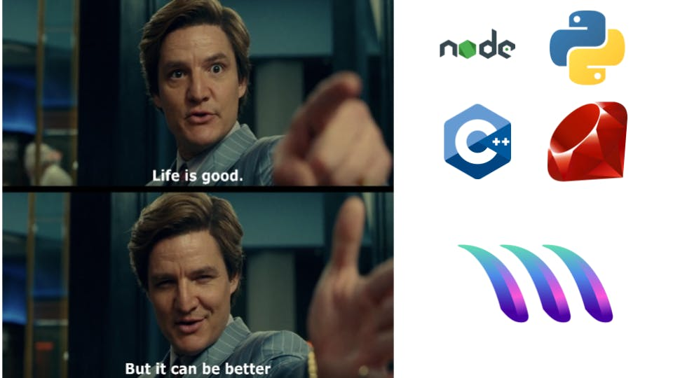

[Google Summer of Code](https://summerofcode.withgoogle.com/) is an annual program by Google, which provides an opportunity to Student Developers who are looking to get started with Open-Source development. “Open-Source”, as a term itself, was very intimidating to me which I presumed involved a lot of development and understanding of the entire codebase to contribute, and boy was I wrong. This small write up intends to detail and document my learnings (and unlearning) with Open-Source and how I got to be a Google Summer of Code 2021 Student with [MetaCall](https://summerofcode.withgoogle.com/organizations/5830976665550848/).

## Getting Started

I was introduced to the term “Open-Source” through one of my College Seniors, who was incidentally the first person from my College to have been selected in Google Summer of Code. His inspirational work made a lot of students follow suit and get started with Open-Source but many lost interest during the way. I was one of the students who created a [GitHub Account](github.com/harshcasper) back in 2019 but lost interest midway and primarily used it for pushing personal projects.

My first contribution to Open-Source came through [Hacktoberfest-2019](https://hacktoberfest.digitalocean.com/). I created my first [Pull Request](https://github.com/Sathyabama-Coding-Club/HacktoberFest2019/pull/33) to add an [Insertion Sort algorithm](https://github.com/Sathyabama-Coding-Club/HacktoberFest2019/blob/master/Data%20Structure+Algorithm/Sorting/Insertion%20Sort/insertion_sort.c) and it was merged. My College Seniors, [Abhiram Reddy](https://github.com/abhiramready) and [Akash M](https://github.com/AkashM398) provided the meaningful guidance that I was looking for to get started with Open Source. After Hacktoberfest, my Open-Source work was diluted due to my College Exams and Projects, but I kept looking for more Open-Source programs to participate in regularly.

## Launching into Open-Source Programs

I participated in my first fully-fledged Open-Source program in December 2019 as part of the [JIIT Month of Code](https://github.com/JIITODC/JMoC-website). While I was selected without any standard proposal or application process, I was intimidated by the projects until I found [Anmol Mishra](https://github.com/anmol27katyani). He started mentoring me on one of his projects. As part of the same, I worked on building Python scripts which received very positive feedback and I became one of the [Top-Performers](https://github.com/JIITODC/JMOC-PROFILE/blob/master/v2019/Results.md) of the whole program.

Next planned up was [GirlScript Summer of Code](http://gssoc.girlscript.tech/), which is an Open-Source competition, where I ranked 59 across thousands of participants from across India. I contributed to [CropAI](https://github.com/cropai), [Algo-DS Notes](https://github.com/jainaman224/Algo_Ds_Notes), [Cosmos](https://github.com/opengenus/cosmos) and [JARVIS](https://github.com/the-vision/jarvis-core), [Techtonica](https://github.com/Techtonica/curriculum) Projects using a wide variety of technology stacks that helped me upskill in a better way.  

The best experience in Open Source came through the [MLH Fellowship](https://fellowship.mlh.io/), where I have received a lot of guidance and help around the best practices of Open Source development. Working on [Hackathon projects](https://devpost.com/HarshCasper) exposed me to the nuances of Open-Source development like nothing else and prompted me enough to explore communities around me and participate in them. It allowed me to become a part of various communities like [moja global](https://github.com/moja-global), [OpenMined](http://github.com/openmined), [WooTech](https://github.com/WooTechnology) and more.

I also stepped up in my contributions and contributed to various organizations including [Google](http://github.com/google), [Uber](http://github.com/uber), [Amazon Web Services](https://github.com/aws/), [Microsoft](https://github.com/microsoft) to name a few. While the contributions were enough to have me started, I decided to look out for some mentorship to help me get started on a more consistent basis.

## Planning for Google Summer of Code

After a nasty rejection from the MLH Fellowships’ [Open Source batch](https://fellowship.mlh.io/programs/open-source) and the [LFX Community Bridge Mentorship program](https://mentorship.lfx.linuxfoundation.org/), I decided to go for Google Summer of Code. My motivation was to find a community that I can stick to long during the whole process, even though I won’t be selected. My initial experimentations around communities did not go well and in most cases, things were too competitive to even consider. While I started with an intention to work on Web/DevOps projects I soon ran out of organizations that I would like to work with.

It was during this time when I realized that I need to find my passion to fit into the puzzle rather than trying to mould myself for the same. It was then that I started looking for communities whose ideas I found interesting and were willing to contribute to the same. Before the announcement of the Google Summer of Code 2021 organizations, I decided to participate with [CCExtractor](http://github.com/ccextractor/) or [OWASP](http://github.com/owasp/). It was at this time, I came to know about [MetaCall](https://github.com/metacall).  

I came across one of the blog posts which described a [Serverless Polyglot which scrapped links across a website](https://medium.com/@metacall/this-scraping-serverless-polyglot-is-metacall-c13223ae1cb5) using MetaCall. The idea was interesting and the technology seemed novel. I joined the community and was greeted by [Vicente](https://twitter.com/parradeadlock), the creator of [MetaCall.io](http://metacall.io/) and the Organization administrator who was kind enough to welcome me personally and get me started. I had no idea that MetaCall had applied for Google Summer of Code and when the organizations were announced it was a welcome shock for me.

Now that I made up my mind, I decided to contribute to MetaCall. My first few weeks went in observation and studies around the standard processes. I later picked pace with creating my [Proofs-of-Concept](https://github.com/metacall/url-shortener-example) around building Polyglot applications, which was later converted into a [blog piece](https://blog.harshcasper.com/polyglot-programming-with-metacall). One of my [Proofs-of-Concept]() around building a Polyglot Machine Learning application was picked up for a talk at [HolyJS](https://www.youtube.com/watch?v=Is1m8ny8R9c) where [Vicente](https://twitter.com/parradeadlock) and [Jose](https://twitter.com/_joseado) explained in detail about MetaCall and how the Function-as-a-Service (FaaS) works.

> HolyJS Talk with Machine Learning-based News Scrapper in action

Once I had a fair understanding, I decided to take a look at the projects available and I picked up the [Jupyter MetaCall Kernel](https://github.com/metacall/gsoc-2021#jupyter-metacall-kernel) project. This was where I reached out to [Gill](github.com/giarve), who would mentor this project and indulged in a discussion with him. After a lot of intricate brainstorming and discussions, we finally decided on the approach, the deliverables and the minimal viable product that we are aiming for. And this is when I started my work on the proposal.  

Both the proposal and the reviews took much less time than I had anticipated. While I initially lacked the confidence, I decided to give it a go and uploaded my draft and further the final proposal on the Google Summer of Code dashboard. By the end, I only managed to submit my proposal for MetaCall and had to drop off [CCExtractor](http://github.com/ccextractor/) and [OWASP](http://github.com/owasp/) after further considerations.

The disquieting wait after the application was submitted had started.

## Waiting Period

As far as I have known the past experiences of Google Summer of Code students, I knew that the waiting period wasn’t at all to **“wait”**. I decided to be more active in the community than before and pick up things that can more streamline the experience of new contributors. I discussed it with [Vicente](https://twitter.com/parradeadlock) and decided to work on a [Get Started](https://github.com/metacall/get-started) guide. It would be a fairly easy way for people to navigate across MetaCall and contribute in a way that they find fit.

> Getting Started Guide for MetaCall (metacall.github.io/get-started)

During the waiting period, I indulged in developing the [Get Started Guide](https://metacall.github.io/get-started) on Docsify and successfully managed to complete it before the results. The day of the result was a very, very long day.

Fast forward to May 17, 11:04 PM IST, the following mail dropped on my inbox:

> Google Summer of Code Acceptance Mail

And I was on the Cloud Nine!

My proposal [“Development of Jupyter Kernel for MetaCall Core”](https://summerofcode.withgoogle.com/projects/#5883852846792704) has finally been accepted!

## About the Project

My project revolves around the development of a Jupyter Kernel for the MetaCall Core. [MetaCall Core](https://github.com/metacall/core) is a library that allows for cross-language function calls to happen. My project would allow the inter-language mixing process to happen from a Jupyter Client straight from the browser, rather than using the traditional [Command Line Interface (CLI)](https://github.com/metacall/core/tree/develop/source/cli) and REPL that MetaCall Core provides.

The primary goal for the project has been divided into three milestones:

-   Developing the Kernel for MetaCall using IPython to load the API.    
-   Integrate the Kernel to MetaCall’s API to build polyglot applications. 
-   Test the Kernel and deploy the interface as a package.

During this project, I would be mentored by [Gil Arasa Verge](github.com/giarve) with special assistance from [Vicente](github.com/viferga). In the further blogs, I would be further sharing my experiences and technical details around my project and progress over the same.

