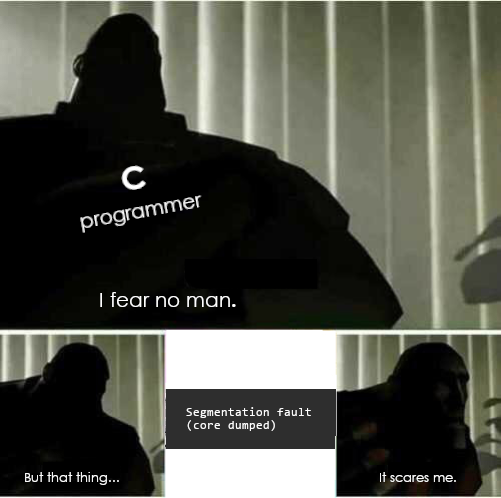

[Google Summer of Code 2021](https://summerofcode.withgoogle.com/) Coding Period started with a bang on June 7. After weeks of pre-planning and preparation, I was finally able to set things in motion with my project. The first week of the Coding Period required me to set up a Kernel skeleton for the project which would enable the MetaCall Core initialization.

The end product of the Google Summer of Code coding period is to develop a [Jupyter Notebook interface](https://github.com/metacall/jupyter-kernel) that supports various runtimes and can enable developers to inter-mix languages amongst each other.

> One Ring to rule them all, One Ring to find them, One Ring to bring them all ~ J.R.R Tolkein

## Progress

The first week was spent on initializing a skeleton kernel from where MetaCall’s [Core library](https://github.com/metacall/core) can be initialized and put to use. For this purpose, I decided to use IPython which provides a feature-rich [Jupyter Notebook](https://jupyter.org/) interface that allows session logging, reloading, multi-line editing, interactive widgets and much more. During the community bonding period, I studied a lot of [IPython documentation](https://ipython.readthedocs.io/) and [some of the implementations](https://github.com/jupyter/jupyter/wiki/A-gallery-of-interesting-Jupyter-Notebooks#notebooks-in-languages-other-than-python) around the same.

> How IPython Kernel mechanism works?

After a lot of introspection, I decided to write a wrapper kernel around MetaCall Core that would ensure that the [Core APIs](https://github.com/metacall/core/tree/develop/docs#531-loaders) are loaded and executed successfully. IPython abstracts a lot of details for us and hence it was suited for me to make use of wrapper kernels to ensure that the code is loaded appropriately and executed using MetaCall’s API.

I made a Pull Request ([#4](https://github.com/metacall/jupyter-kernel/pull/4)) to add the same to the project repository. The wrapper kernel makes use of the communications machinery from IPython while leaving the core execution part to us, which has been left in the TO-DO. This core execution part would be carried out in the coming weeks to ensure that the end purpose of the project is achieved suitably.

> Battling Flake8 issues are tough!

Further, Continuous Integration Pipelines for Code and Documentation were set up. I made a Pull Request ([#5](https://github.com/metacall/jupyter-kernel/pull/5)) to make use of [GitHub Actions](https://github.com/features/actions) to test the build across multiple Python versions and throw any errors if found. Apart from this, the existing code was formatted using [Black](https://github.com/psf/black) and a [Flake8](https://pypi.org/project/flake8/) configuration for Python linting was added through a Pull Request ([#8](https://github.com/metacall/jupyter-kernel/pull/8)).

Lastly, a Documentation Site was developed using [Sphinx](https://www.sphinx-doc.org/), to auto-generate documentation from inline comments and docstrings. The Pull Request ([#6](https://github.com/metacall/jupyter-kernel/pull/6)) adds the suitable sub-directory along with a CI action to test the documentation build.

> The documentation site for MetaCall's Jupyter Kernel using the RTD Theme

## Blockers

The primary blocker during the first week was related to the MetaCall’s Core installation and the issue that was discovered in the upstream Core project. Due to this, the Python scripts that were loaded through MetaCall's CLI threw segmentation faults and were executed twice. The issue has been hopefully fixed and a [new release](https://gitlab.com/metacall/distributable/-/pipelines/321614563) has been created.

> And I struggled real hard against it, being a Python programmer!

Apart from this, there was a hard struggle against the dependency management in Python and setting it up on the GitHub Actions CI. Even on my machine, switching between various virtual environments to manage dependencies was nothing short of a hell, which I’m finally recovering from.

> Frameworks are sassy! Their installations are not!

## Learnings

The learning opportunities provided during the first week were simply enormous. I learnt about using [GNU Debugger](https://www.gnu.org/s/gdb/) (`gdb`) for debugging issues and generating stack traces around MetaCall, from my mentor Gill. Apart from this, I got a chance to study the [Python port](https://github.com/metacall/core/tree/develop/source/ports/py_port) provided by MetaCall and understand how the APIs are structured and how I can make use of them.

Apart from this, I spent some time learning about Sphinx and how auto-generated documentation sites work. With my prior experiences in JavaScript-based Static Site Generators like [Docusaurus](https://docusaurus.io/) and [Vuepress](https://vuepress.vuejs.org/), Sphinx was a welcome thing for me to learn and I will pursue documenting my existing Python projects using the same.

> Best thing to learn in the first week!

## Plans for next week

While I'm writing this blog, the second week of the Coding period is already in progress. During this week, I would like to make sure that MetaCall's initialization is successful and now I can load the code from memory and execute it on the fly. I would also be spending some time writing tests and adding them to the CI pipeline.

The first-week progress has been received positively by my mentor and the community. It has been a great experience working so far and I hope I can work even more in the coming weeks and successfully execute the project.

Signing off the first-week log about my Google Summer of Code experience!

